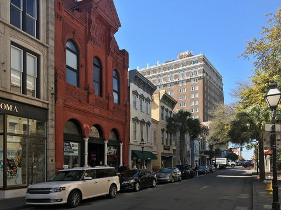
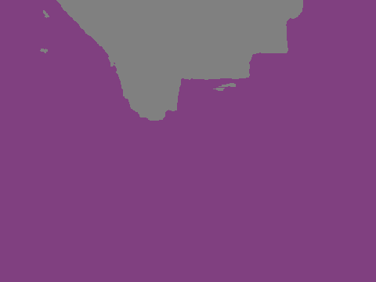
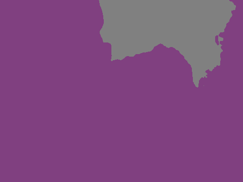
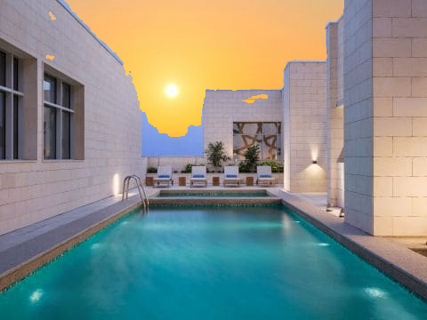
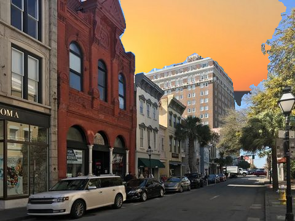

# segnet
## Requirements
* Python 3.6
* Tensorflow GPU (1.13.1)      ```pip install tensorflow-gpu==1.13.1```
* Keras 2.0.8        ```pip install keras```
* cv2 (4.1.0)        ```pip install opencv-python==4.1.0```
* numpy (1.16.3)     ```pip install numpy==1.16.3```

## Pretrained Model
Download pretrained model from <https://drive.google.com/file/d/1T1INhutItUOOJ-iWicu4VjQCdUXi29wE/view?usp=sharing> and place it in the segnet folder.
<br>
Pretrained model was trained with CamVid dataset, which contains \[Sky, Building, Pole, Road_marking, Road, Pavement, Tree, SignSymbol, Fence, Car, Pedestrian, Bicyclist, Unlabelled\] labels.
<br>
Images are 360\*480 size.


## Test
The following guide is to segment the sky from images and change the sky to new sky/backgrounds.
<br>
1. Edit val.txt file. The file should contain the paths to your input images.
2. ```python train.py --style /path/to/your/style/image/``` will first detect sky in images, save the segmented images in the 'output' folder, and finally apply new style to images.
<br>

## Example


<br>


<br>


